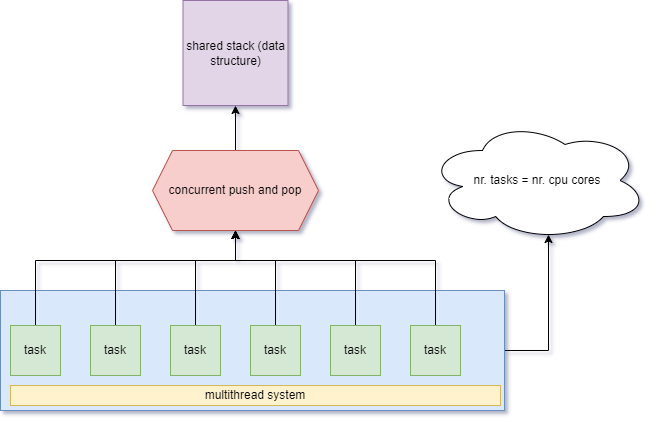

# Multithreading in Rust
Crates: crossterm, tokio, num_cpus, rand, reqwest

Description: multithread application sample implemented using tokio (parallel job execution). Every task accesses concurrently to a shared queue, makes a pop and simulates a job processing. 

# Diagram

# Screenshot

